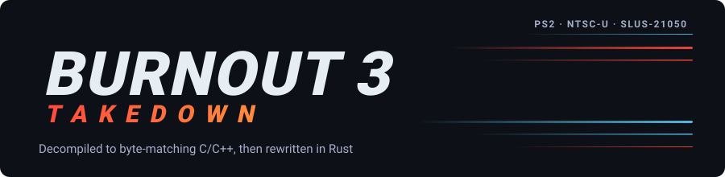
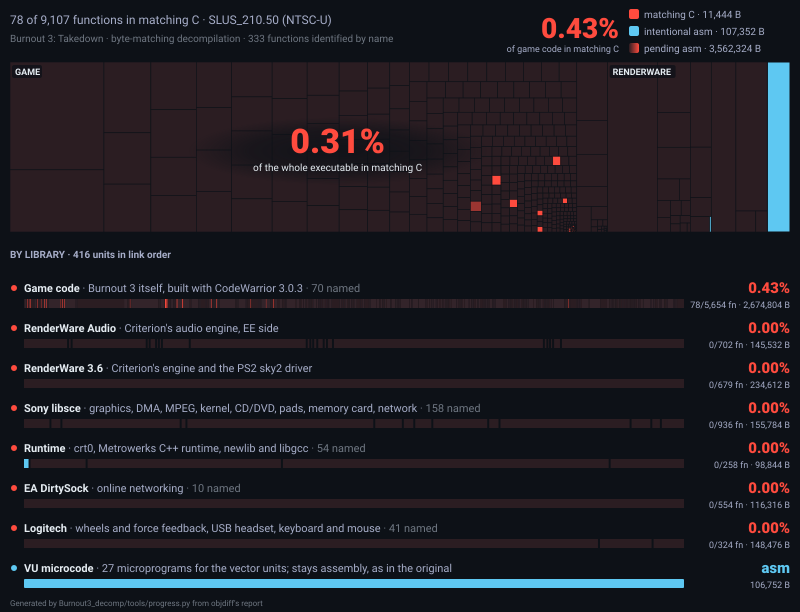

<p align="center">
  <picture>
    <source media="(prefers-color-scheme: dark)" srcset="assets/banner-dark.svg">
    <source media="(prefers-color-scheme: light)" srcset="assets/banner-light.svg">
    
  </picture>
</p>

<p align="center">
  <b>Reconstructing Burnout 3: Takedown's PS2 game code as byte-matching C/C++.</b>
</p>

<p align="center">
  <a href="Burnout3_decomp/PROGRESS.md"></a>
  <a href="Burnout3_decomp/README.md#building"></a>
  <a href="#supported-version"></a>
  <a href="Burnout3_decomp/docs/compiler.md"></a>
  <a href="LICENSE"></a>
</p>

<p align="center">
  <a href="ROADMAP.md"><b>Roadmap</b></a> ·
  <a href="Burnout3_decomp/PROGRESS.md"><b>Progress</b></a> ·
  <a href="Burnout3_decomp/docs/layout.md"><b>Memory layout</b></a> ·
  <a href="Burnout3_decomp/README.md"><b>Build guide</b></a> ·
  <a href="#contributing"><b>Contributing</b></a>
</p>

> [!NOTE]
> **Done:** the matching build (byte-identical, from assembly), the compiler (D2) and the map of the binary (D3).
> **Now:** D4 (core infrastructure) is done with a tail of 6; D5 (main loop and game flow) is done with a
> [recorded tail of 10 unmatched functions](Burnout3_decomp/docs/d5.md#recorded-tail). D6 is next; tail runs complete the remaining matches.
> Game code gets Criterion's own class and function names from [Burnout 2's DWARF-named decomp](Burnout3_decomp/docs/burnout2.md).
> **Scope:** Burnout 3's game code. Vendor libraries are preserved dependencies, with existing sources and decomps
> used to recover their interfaces. A native Rust rewrite remains a deferred, long-term goal.

<h3>PS2 game-source decompilation progress</h3>

<p align="center">
  <a href="Burnout3_decomp/PROGRESS.md">
    
  </a>
</p>

Every tile is a **game-code translation unit**, sized by code bytes and shaded red as its functions move from assembly
to matching C/C++. The headline, map and badge all use the same `game` category. The main percentage is matching
**code bytes**; the function percentage is reported separately. "Named" counts only identified game functions,
whether or not they are in C yet. [PROGRESS.md](Burnout3_decomp/PROGRESS.md) gives the exact counts and scope.

RenderWare graphics/audio, Sony libsce, runtime, EA DirtySock, Logitech libraries, startup assembly and VU microcode
are outside this completion metric. Their original assembly remains in the build, which still must reproduce the
original executable's SHA-1 and run in PCSX2. The map, badge and progress table are regenerated by `tools/progress.py`
after each build; they are not edited by hand.

The current milestone is all game-code functions in matching C/C++, including the game-side rendering, audio,
network and device integration. Full middleware reconstruction is optional supporting work. See
[ROADMAP.md](ROADMAP.md) for the completion gate. The [Rust workspace](Burnout3_rust/README.md) currently provides
the ISO extractor; its native rewrite is a long-term goal outside this PS2 decomp milestone.

<h3>Reuse existing library work</h3>

Recover library names, types and behavior from existing work before reverse engineering an interface from scratch:

| Dependency | Existing references | How we use them |
|---|---|---|
| RenderWare graphics and audio | [Burnout 2](https://github.com/b3dllc/burnout2), [3.7 source](https://github.com/sigmaco/rwsrc-v3.7.0.2), [Persona 4](https://github.com/Raikaru/Persona4-Decompilation), [plugin-sdk](https://github.com/DK22Pac/plugin-sdk), [librw](https://github.com/aap/librw) | Start from recovered PS2 driver/audio bodies, shared core algorithms and 3.6 declarations. Versions differ; some references are wrappers or stubs. |
| Sony libsce and runtime | [ICO](https://github.com/nathanialf/ico), [PS2SDK](https://github.com/ps2dev/ps2sdk), [newlib](https://sourceware.org/newlib/), [fdlibm](https://www.netlib.org/fdlibm/), [historical libgcc](https://github.com/gcc-mirror/gcc/blob/releases/gcc-2.95.2/gcc/libgcc2.c) | Use reconstructed library bodies, upstream algorithms and PS2 interface definitions to understand game calls. |
| EA DirtySock | [partial 4.7.0/5.6.2 reconstruction](https://github.com/deadbeef7/DirtySDK), [7.5.3 source](https://github.com/kitsilanosoftware/DirtySDK) | Recover transport state and protocol behavior; establish our exact version and PS2 RPC differences. |
| Logitech devices | [Burnout 2 lgdevPS2.c](https://github.com/b3dllc/burnout2/blob/master/src/gamesource/toolkits/lgdevPS2.c), [Speex](https://www.speex.org/downloads/) | Reuse device/RPC and codec knowledge; headset and keyboard/mouse coverage remains partial. |

These references are not drop-in replacements for the matching build. Keep preserved vendor assembly until a candidate
matches our binary under the correct library compiler. No complete verified PS2 RenderWare 3.6 engine was found.
The [library research](Burnout3_decomp/docs/library-references.md) records the evidence and gaps.

<h3>Supported version</h3>

| Game | Platform | Region | Serial | Boot executable |
|---|---|---|---|---|
| Burnout 3: Takedown | PlayStation 2 | NTSC-U | SLUS-21050 (`VER 1.00`) | `SLUS_210.50` |

```text
ISO          SHA-1 11a7f335a37d2f3f5c13b967f3072c84f8eded02
SLUS_210.50  SHA-1 332be40d6081b8b5055a6ea01194ad6ff662a863
```

Other regions and revisions are not supported.

> [!WARNING]
> This repo contains **no original game binaries or assets**: no executables, disassembly, assets, VU microcode, BIOS, disc images
> or compilers. You need your own legally obtained copy of the game, your own BIOS dump and your own copy of the
> compiler. The build checks your files' hashes and regenerates everything else locally.

<h3>Quick setup</h3>

You need Docker (the build runs in a linux/amd64 image, through Rosetta on Apple Silicon), Python 3, Rust, your own
dump of the game, and the CodeWarrior PS2 compiler **3.0.1 build 119** (decomp.me build `3.0.1b119-040914`) in
`Burnout3_decomp/compilers/3.0.1b119-040914/`. To run the result: [PCSX2](https://pcsx2.net) 2.x and a BIOS from your own
console.

```bash
# 1. Extract the ELF from your disc
cd Burnout3_rust && cargo run --release -p iso_extract -- extract /path/to/"Burnout 3 - Takedown (USA).iso" ../Burnout3_decomp/orig --only SLUS_210 && cd ..

# 2. Build the image, configure and build
cd Burnout3_decomp
docker build --platform linux/amd64 -t b3-build -f docker/Dockerfile .
tools/dock python3 configure.py
tools/dock ninja        # prints: build/SLUS_210.50: 332be40d… OK
```

The [build guide](Burnout3_decomp/README.md) covers the details, including booting the rebuilt ELF in PCSX2.

<h3>Repository layout</h3>

| Path | What it is |
|---|---|
| [`Burnout3_decomp/`](Burnout3_decomp/README.md) | Active PS2 game-source decomp: `assembly/` (the matching build and preserved dependencies), `c_cpp/` (recovered game C/C++), configs, tools and docs |
| [`Burnout3_rust/`](Burnout3_rust/README.md) | Working ISO extractor and deferred native-rewrite planning |
| [`ROADMAP.md`](ROADMAP.md) | Plan, milestones, testing and machine state |
| `assets/` | README artwork |

<h3>Contributing</h3>

Pick an unmatched **game-code** function, get it to 100% (`tools/funcmatch.py` compiles one function and diffs it against the
original), then add its unit to `C_UNITS` in `Burnout3_decomp/configure.py`. The build must still print the matching
SHA-1. Run `tools/dock python3 tools/progress.py` to update the map. The
[C/C++ guide](Burnout3_decomp/c_cpp/README.md) walks through adding a unit, and
[docs/layout.md](Burnout3_decomp/docs/layout.md) explains how the binary is laid out. Keep original binaries,
generated assembly and extracted data out of commits. Look for the function's Burnout 2 counterpart first ([docs/burnout2.md](Burnout3_decomp/docs/burnout2.md)): the
same engine code often exists there with Criterion's names and layouts. Consult [existing library work](Burnout3_decomp/docs/library-references.md) when a game function
depends on a vendor interface; only reconstruct library internals when that helps the game-source work.

<h3>Related projects</h3>

- **MC3DER (planned):** the same decomp and Rust rewrite for Midnight Club 3: DUB Edition Remix, once its ISO is
  dumped.
- **[GameMerge](https://github.com/siddharthakumar-98/GameMerge):** brings Burnout 3's gameplay (takedowns, boost,
  Crash mode) into Midnight Club 3, using this repo's symbols and, later, its Rust core.

<h3>Credits</h3>

- The [Reburn 3](https://forum.mattkc.com/) community: Burnout 3 reverse engineering
- [b3dllc/burnout2](https://github.com/b3dllc/burnout2), the Burnout 2 decomp whose debug-info names and layouts
  identify Burnout 3's shared Criterion code
- [splat](https://github.com/ethteck/splat), [spimdisasm](https://github.com/Decompollaborate/spimdisasm),
  [objdiff](https://github.com/encounter/objdiff), [m2c](https://github.com/matt-kempster/m2c),
  [decomp.me](https://decomp.me) and [wibo](https://github.com/decompals/wibo)
- [librw](https://github.com/aap/librw), an open RenderWare reimplementation used as a reference
- [PCSX2](https://github.com/PCSX2/pcsx2)
- The progress map's design follows [Lombyte](https://github.com/lombyte-project/Lombyte)'s

<h3>License</h3>

GPL-3.0. See [LICENSE](LICENSE).

Burnout is a trademark of Electronic Arts. RenderWare is a trademark of Criterion Software. This is an unofficial fan
project with no affiliation to either. It publishes decompiled source, headers, symbol names, build configs, original
Rust code and documentation only, and honors takedown requests.
